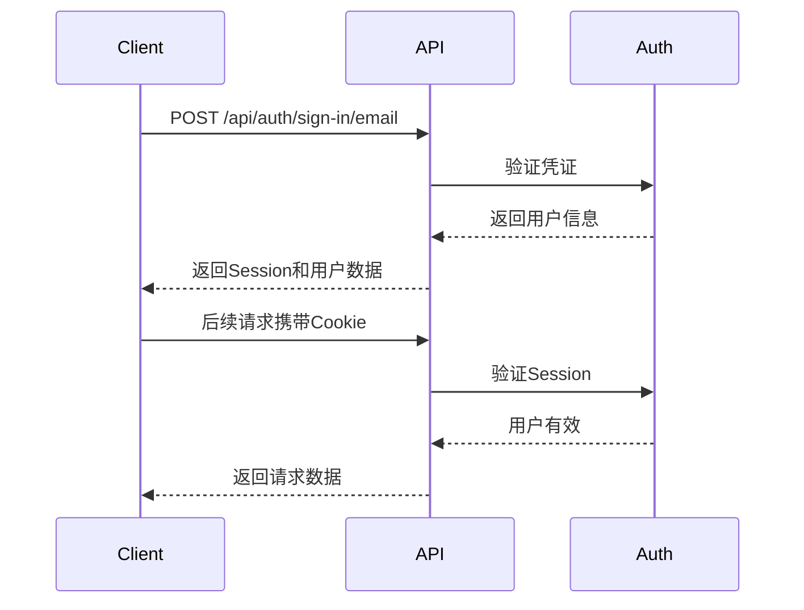

# API 文档 - JD Optimizer

本文档提供了JD Optimizer完整的API参考指南。

## 📋 目录

- [概述](#概述)
- [认证方式](#认证方式)
- [API端点](#api端点)
  - [认证API](#认证api)
  - [用户API](#用户api)
  - [JD管理API](#jd管理api)
  - [AI生成API](#ai生成api)
  - [支付API](#支付api)
  - [存储API](#存储api)
  - [聊天API](#聊天api)
- [请求/响应格式](#请求响应格式)
- [错误码说明](#错误码说明)
- [速率限制](#速率限制)
- [SDK和客户端库](#sdk和客户端库)

## 概述

JD Optimizer提供RESTful API接口，支持开发者集成AI驱动的JD优化功能到自己的应用中。

**基础URL:**
- 开发环境: `http://localhost:3000/api`
- 生产环境: `https://api.jd-optimizer.com/api`

**API版本:** v1

**内容类型:** `application/json`

## 认证方式

JD Optimizer使用Better Auth进行用户认证，支持多种认证方式：

### 1. Session认证

通过登录后获得的Session进行认证。

```http
GET /api/user/get-user-info HTTP/1.1
Host: api.jd-optimizer.com
Cookie: better-auth.session_token=<session_token>
```

### 2. Bearer Token

某些API端点支持Bearer Token认证。

```http
GET /api/user/get-user-info HTTP/1.1
Host: api.jd-optimizer.com
Authorization: Bearer <access_token>
```

### 3. OAuth认证

支持第三方OAuth登录：

- GitHub
- Google

#### GitHub OAuth

```http
GET /api/auth/sign-in/github
```

#### Google OAuth

```http
GET /api/auth/sign-in/google
```

### 认证流程



## API端点

### 认证API

#### 注册用户

使用邮箱和密码注册新用户。

**请求:**

```http
POST /api/auth/sign-up/email HTTP/1.1
Content-Type: application/json

{
  "email": "user@example.com",
  "password": "secure_password",
  "name": "John Doe"
}
```

**响应:**

```json
{
  "success": true,
  "data": {
    "user": {
      "id": "user_abc123",
      "email": "user@example.com",
      "name": "John Doe",
      "emailVerified": false,
      "createdAt": "2024-01-01T00:00:00Z"
    },
    "session": {
      "token": "session_token_xyz",
      "expiresAt": "2024-01-08T00:00:00Z"
    }
  }
}
```

#### 用户登录

使用邮箱和密码登录。

**请求:**

```http
POST /api/auth/sign-in/email HTTP/1.1
Content-Type: application/json

{
  "email": "user@example.com",
  "password": "secure_password"
}
```

**响应:**

```json
{
  "success": true,
  "data": {
    "user": {
      "id": "user_abc123",
      "email": "user@example.com",
      "name": "John Doe",
      "emailVerified": true
    },
    "session": {
      "token": "session_token_xyz",
      "expiresAt": "2024-01-08T00:00:00Z"
    }
  }
}
```

#### 获取当前会话

获取当前登录用户的信息。

**请求:**

```http
GET /api/auth/get-session HTTP/1.1
Cookie: better-auth.session_token=<session_token>
```

**响应:**

```json
{
  "success": true,
  "data": {
    "user": {
      "id": "user_abc123",
      "email": "user@example.com",
      "name": "John Doe"
    },
    "session": {
      "token": "session_token_xyz",
      "expiresAt": "2024-01-08T00:00:00Z"
    }
  }
}
```

#### 登出

退出当前会话。

**请求:**

```http
POST /api/auth/sign-out HTTP/1.1
Cookie: better-auth.session_token=<session_token>
```

**响应:**

```json
{
  "success": true,
  "data": null
}
```

#### 验证邮箱

发送邮箱验证链接。

**请求:**

```http
POST /api/auth/send-verification-email HTTP/1.1
Content-Type: application/json

{
  "email": "user@example.com"
}
```

**响应:**

```json
{
  "success": true,
  "data": {
    "message": "Verification email sent successfully"
  }
}
```

### 用户API

#### 获取用户信息

获取当前登录用户的详细信息。

**请求:**

```http
POST /api/user/get-user-info HTTP/1.1
Cookie: better-auth.session_token=<session_token>
```

**响应:**

```json
{
  "success": true,
  "data": {
    "id": "user_abc123",
    "email": "user@example.com",
    "name": "John Doe",
    "emailVerified": true,
    "image": "https://example.com/avatar.jpg",
    "role": "user",
    "isAdmin": false,
    "credits": {
      "remainingCredits": 100
    },
    "createdAt": "2024-01-01T00:00:00Z"
  }
}
```

#### 检查邮箱验证状态

检查用户邮箱是否已验证。

**请求:**

```http
POST /api/user/is-email-verified HTTP/1.1
Cookie: better-auth.session_token=<session_token>
```

**响应:**

```json
{
  "success": true,
  "data": {
    "isVerified": true
  }
}
```

#### 获取用户积分

获取用户剩余的积分数量。

**请求:**

```http
POST /api/user/get-user-credits HTTP/1.1
Cookie: better-auth.session_token=<session_token>
```

**响应:**

```json
{
  "success": true,
  "data": {
    "remainingCredits": 100,
    "totalCredits": 500,
    "usedCredits": 400
  }
}
```

### JD管理API

#### 创建JD

创建新的职位描述。

**请求:**

```http
POST /api/jds HTTP/1.1
Cookie: better-auth.session_token=<session_token>
Content-Type: application/json

{
  "title": "高级前端工程师",
  "description": "我们需要一位经验丰富的前端工程师...",
  "requirements": ["React", "TypeScript", "5年以上经验"],
  "benefits": ["弹性工作", "股票期权", "培训机会"],
  "location": "北京",
  "salary": "25k-40k",
  "employmentType": "全职"
}
```

**响应:**

```json
{
  "success": true,
  "data": {
    "id": "jd_xyz789",
    "title": "高级前端工程师",
    "description": "我们需要一位经验丰富的前端工程师...",
    "requirements": ["React", "TypeScript", "5年以上经验"],
    "benefits": ["弹性工作", "股票期权", "培训机会"],
    "location": "北京",
    "salary": "25k-40k",
    "employmentType": "全职",
    "status": "draft",
    "createdAt": "2024-01-01T00:00:00Z",
    "updatedAt": "2024-01-01T00:00:00Z"
  }
}
```

#### 获取JD列表

获取用户的所有职位描述列表。

**请求:**

```http
GET /api/jds?page=1&limit=10&status=draft HTTP/1.1
Cookie: better-auth.session_token=<session_token>
```

**查询参数:**

| 参数 | 类型 | 必需 | 描述 |
|------|------|------|------|
| page | integer | 否 | 页码，默认1 |
| limit | integer | 否 | 每页数量，默认10 |
| status | string | 否 | 筛选状态: draft, published, archived |

**响应:**

```json
{
  "success": true,
  "data": {
    "items": [
      {
        "id": "jd_xyz789",
        "title": "高级前端工程师",
        "status": "draft",
        "createdAt": "2024-01-01T00:00:00Z"
      }
    ],
    "total": 50,
    "page": 1,
    "limit": 10,
    "totalPages": 5
  }
}
```

#### 获取JD详情

获取特定职位描述的详细信息。

**请求:**

```http
GET /api/jds/{jdId} HTTP/1.1
Cookie: better-auth.session_token=<session_token>
```

**路径参数:**

| 参数 | 类型 | 描述 |
|------|------|------|
| jdId | string | JD的ID |

**响应:**

```json
{
  "success": true,
  "data": {
    "id": "jd_xyz789",
    "title": "高级前端工程师",
    "description": "我们需要一位经验丰富的前端工程师...",
    "requirements": ["React", "TypeScript", "5年以上经验"],
    "benefits": ["弹性工作", "股票期权", "培训机会"],
    "location": "北京",
    "salary": "25k-40k",
    "employmentType": "全职",
    "status": "draft",
    "version": 1,
    "createdAt": "2024-01-01T00:00:00Z",
    "updatedAt": "2024-01-01T00:00:00Z"
  }
}
```

#### 更新JD

更新现有的职位描述。

**请求:**

```http
PUT /api/jds/{jdId} HTTP/1.1
Cookie: better-auth.session_token=<session_token>
Content-Type: application/json

{
  "title": "高级前端工程师（更新）",
  "description": "更新后的描述..."
}
```

**响应:**

```json
{
  "success": true,
  "data": {
    "id": "jd_xyz789",
    "title": "高级前端工程师（更新）",
    "description": "更新后的描述...",
    "version": 2,
    "updatedAt": "2024-01-02T00:00:00Z"
  }
}
```

#### 删除JD

删除职位描述。

**请求:**

```http
DELETE /api/jds/{jdId} HTTP/1.1
Cookie: better-auth.session_token=<session_token>
```

**响应:**

```json
{
  "success": true,
  "data": {
    "id": "jd_xyz789",
    "deleted": true
  }
}
```

#### AI优化JD

使用AI智能优化职位描述。

**请求:**

```http
POST /api/jds/{jdId}/optimize HTTP/1.1
Cookie: better-auth.session_token=<session_token>
Content-Type: application/json

{
  "optimizationType": "grammar",
  "targetTone": "professional",
  "language": "zh-CN"
}
```

**请求参数:**

| 参数 | 类型 | 必需 | 描述 |
|------|------|------|------|
| optimizationType | string | 是 | 优化类型: grammar, style, completeness, all |
| targetTone | string | 否 | 目标语调: professional, casual, enthusiastic |
| language | string | 否 | 目标语言: zh-CN, en-US |

**响应:**

```json
{
  "success": true,
  "data": {
    "taskId": "ai_task_123",
    "status": "processing",
    "optimizationType": "grammar",
    "createdAt": "2024-01-01T00:00:00Z"
  }
}
```

### AI生成API

#### 生成AI内容

使用AI生成各种类型的内容。

**请求:**

```http
POST /api/ai/generate HTTP/1.1
Cookie: better-auth.session_token=<session_token>
Content-Type: application/json

{
  "provider": "openrouter",
  "mediaType": "text",
  "model": "anthropic/claude-3-sonnet",
  "prompt": "为Java后端工程师职位描述生成技能要求",
  "options": {
    "temperature": 0.7,
    "maxTokens": 500
  },
  "scene": "text-generation"
}
```

**请求参数:**

| 参数 | 类型 | 必需 | 描述 |
|------|------|------|------|
| provider | string | 是 | AI服务提供商: openrouter, replicate |
| mediaType | string | 是 | 媒体类型: text, image, video, music |
| model | string | 是 | 模型名称 |
| prompt | string | 条件 | 文本提示（文本生成必需） |
| options | object | 否 | 生成选项 |
| scene | string | 是 | 使用场景 |

**响应:**

```json
{
  "success": true,
  "data": {
    "id": "ai_task_456",
    "userId": "user_abc123",
    "mediaType": "text",
    "provider": "openrouter",
    "model": "anthropic/claude-3-sonnet",
    "prompt": "为Java后端工程师职位描述生成技能要求",
    "scene": "text-generation",
    "status": "processing",
    "taskId": "external_task_789",
    "costCredits": 2,
    "createdAt": "2024-01-01T00:00:00Z"
  }
}
```

#### 查询AI任务状态

查询AI生成任务的状态和结果。

**请求:**

```http
POST /api/ai/query HTTP/1.1
Cookie: better-auth.session_token=<session_token>
Content-Type: application/json

{
  "taskId": "ai_task_456"
}
```

**响应:**

```json
{
  "success": true,
  "data": {
    "id": "ai_task_456",
    "status": "completed",
    "taskResult": {
      "text": "1. 精通Java编程语言，熟悉JVM原理\n2. 深入理解Spring Boot等主流框架..."
    },
    "taskInfo": {
      "model": "anthropic/claude-3-sonnet",
      "tokensUsed": 350
    },
    "updatedAt": "2024-01-01T00:01:00Z"
  }
}
```

### 支付API

#### 创建支付会话

创建支付会话用于购买积分或订阅。

**请求:**

```http
POST /api/payment/checkout HTTP/1.1
Cookie: better-auth.session_token=<session_token>
Content-Type: application/json

{
  "provider": "stripe",
  "planId": "plan_basic",
  "amount": 9.99,
  "currency": "USD"
}
```

**响应:**

```json
{
  "success": true,
  "data": {
    "checkoutUrl": "https://checkout.stripe.com/pay/cs_test_...",
    "sessionId": "cs_test_...",
    "provider": "stripe"
  }
}
```

#### 支付回调

处理支付成功后的回调。

**请求:**

```http
POST /api/payment/callback HTTP/1.1
Content-Type: application/json

{
  "provider": "stripe",
  "sessionId": "cs_test_...",
  "paymentStatus": "completed"
}
```

**响应:**

```json
{
  "success": true,
  "data": {
    "message": "Payment processed successfully",
    "creditsAdded": 100
  }
}
```

#### 支付通知

处理支付服务提供商的Webhook通知。

**请求:**

```http
POST /api/payment/notify/{provider} HTTP/1.1
Content-Type: application/json
{
  "id": "evt_...",
  "object": "checkout.session.completed",
  "data": {
    "object": {
      "id": "cs_test_...",
      "payment_status": "paid"
    }
  }
}
```

### 存储API

#### 上传图片

上传图片到存储服务。

**请求:**

```http
POST /api/storage/upload-image HTTP/1.1
Cookie: better-auth.session_token=<session_token>
Content-Type: multipart/form-data

file: <binary_data>
folder: "avatars"
```

**响应:**

```json
{
  "success": true,
  "data": {
    "url": "https://cdn.jd-optimizer.com/avatars/user_123.jpg",
    "key": "avatars/user_123.jpg",
    "size": 102400,
    "width": 800,
    "height": 800,
    "format": "jpg"
  }
}
```

### 聊天API

#### 创建聊天会话

创建新的聊天会话用于AI辅助编写JD。

**请求:**

```http
POST /api/chat/new HTTP/1.1
Cookie: better-auth.session_token=<session_token>
Content-Type: application/json

{
  "title": "前端工程师JD编写"
}
```

**响应:**

```json
{
  "success": true,
  "data": {
    "id": "chat_abc123",
    "title": "前端工程师JD编写",
    "createdAt": "2024-01-01T00:00:00Z"
  }
}
```

#### 发送消息

发送消息到聊天会话并获取AI响应。

**请求:**

```http
POST /api/chat/messages HTTP/1.1
Cookie: better-auth.session_token=<session_token>
Content-Type: application/json

{
  "chatId": "chat_abc123",
  "content": "帮我写一份React前端工程师的JD"
}
```

**响应:**

```json
{
  "success": true,
  "data": {
    "id": "msg_xyz789",
    "role": "assistant",
    "content": "当然，以下是一份React前端工程师的职位描述：...",
    "createdAt": "2024-01-01T00:00:01Z"
  }
}
```

#### 获取聊天列表

获取用户的所有聊天会话。

**请求:**

```http
GET /api/chat/list?page=1&limit=10 HTTP/1.1
Cookie: better-auth.session_token=<session_token>
```

**响应:**

```json
{
  "success": true,
  "data": {
    "items": [
      {
        "id": "chat_abc123",
        "title": "前端工程师JD编写",
        "messageCount": 15,
        "lastMessageAt": "2024-01-01T12:00:00Z"
      }
    ],
    "total": 5
  }
}
```

#### 获取聊天信息

获取聊天会话的详细信息。

**请求:**

```http
POST /api/chat/info HTTP/1.1
Cookie: better-auth.session_token=<session_token>
Content-Type: application/json

{
  "chatId": "chat_abc123"
}
```

**响应:**

```json
{
  "success": true,
  "data": {
    "id": "chat_abc123",
    "title": "前端工程师JD编写",
    "messages": [
      {
        "id": "msg_1",
        "role": "user",
        "content": "帮我写一份React前端工程师的JD",
        "createdAt": "2024-01-01T00:00:00Z"
      },
      {
        "id": "msg_2",
        "role": "assistant",
        "content": "当然，以下是一份...",
        "createdAt": "2024-01-01T00:00:01Z"
      }
    ]
  }
}
```

## 请求/响应格式

### 请求格式

所有API请求应遵循以下格式：

#### HTTP方法

- `GET` - 获取资源
- `POST` - 创建资源
- `PUT` - 更新资源（完全替换）
- `PATCH` - 更新资源（部分更新）
- `DELETE` - 删除资源

#### 请求头

```http
Content-Type: application/json
Accept: application/json
Cookie: better-auth.session_token=<token>
Authorization: Bearer <token>
```

#### 请求体

```json
{
  "fieldName": "value",
  "nestedField": {
    "subField": "value"
  }
}
```

### 响应格式

所有API响应遵循统一的格式：

#### 成功响应

```json
{
  "success": true,
  "data": {
    // 响应数据
  }
}
```

#### 错误响应

```json
{
  "success": false,
  "error": {
    "code": "ERROR_CODE",
    "message": "错误描述",
    "details": {
      // 额外的错误详情
    }
  }
}
```

#### 分页响应

```json
{
  "success": true,
  "data": {
    "items": [
      // 数据项
    ],
    "pagination": {
      "page": 1,
      "limit": 10,
      "total": 100,
      "totalPages": 10
    }
  }
}
```

## 错误码说明

| 错误码 | HTTP状态码 | 描述 |
|--------|-----------|------|
| `UNAUTHORIZED` | 401 | 未授权，需要登录或令牌无效 |
| `FORBIDDEN` | 403 | 禁止访问，权限不足 |
| `NOT_FOUND` | 404 | 资源不存在 |
| `VALIDATION_ERROR` | 400 | 请求参数验证失败 |
| `RATE_LIMIT_EXCEEDED` | 429 | 超过速率限制 |
| `INSUFFICIENT_CREDITS` | 402 | 积分不足 |
| `INTERNAL_SERVER_ERROR` | 500 | 服务器内部错误 |
| `SERVICE_UNAVAILABLE` | 503 | 服务暂时不可用 |
| `INVALID_REQUEST` | 400 | 无效的请求 |
| `DUPLICATE_RESOURCE` | 409 | 资源已存在 |
| `EXTERNAL_API_ERROR` | 502 | 外部API调用失败 |

### 错误响应示例

```json
{
  "success": false,
  "error": {
    "code": "VALIDATION_ERROR",
    "message": "请求参数验证失败",
    "details": {
      "fields": {
        "email": "邮箱格式不正确",
        "password": "密码长度至少8位"
      }
    }
  }
}
```

## 速率限制

为了保护服务稳定性，API实施了速率限制。

### 默认限制

- **匿名用户**: 10次/分钟
- **认证用户**: 100次/分钟
- **企业用户**: 1000次/分钟

### 速率限制响应头

```http
X-RateLimit-Limit: 100
X-RateLimit-Remaining: 95
X-RateLimit-Reset: 1609459200
```

### 超过限制响应

```json
{
  "success": false,
  "error": {
    "code": "RATE_LIMIT_EXCEEDED",
    "message": "超过速率限制，请稍后再试",
    "details": {
      "retryAfter": 60
    }
  }
}
```

## SDK和客户端库

### JavaScript/TypeScript SDK

```bash
npm install @jd-optimizer/sdk
```

```typescript
import { JDOptimizerClient } from '@jd-optimizer/sdk'

const client = new JDOptimizerClient({
  apiKey: 'your-api-key',
  baseURL: 'https://api.jd-optimizer.com/api'
})

// 创建JD
const jd = await client.jd.create({
  title: '高级前端工程师',
  description: '我们需要一位经验丰富的前端工程师...',
  // ...
})

// AI优化
const optimized = await client.jd.optimize(jd.id, {
  optimizationType: 'grammar',
  targetTone: 'professional'
})
```

### Python SDK

```bash
pip install jd-optimizer-sdk
```

```python
from jd_optimizer import JDOptimizerClient

client = JDOptimizerClient(
    api_key='your-api-key',
    base_url='https://api.jd-optimizer.com/api'
)

# 创建JD
jd = client.jd.create(
    title='高级前端工程师',
    description='我们需要一位经验丰富的前端工程师...'
)

# AI优化
optimized = client.jd.optimize(jd.id, optimization_type='grammar')
```

## 相关文档

- [快速开始](./README.md#快速开始)
- [开发环境设置](./README.md#开发环境设置)
- [贡献指南](./CONTRIBUTING.md)
- [变更日志](./CHANGELOG.md)

## 联系方式

- **API支持**: api-support@jd-optimizer.com
- **技术文档**: docs.jd-optimizer.com
- **GitHub Issues**: https://github.com/jd-optimizer/jd-optimizer/issues

---

**最后更新**: 2024-01-01
